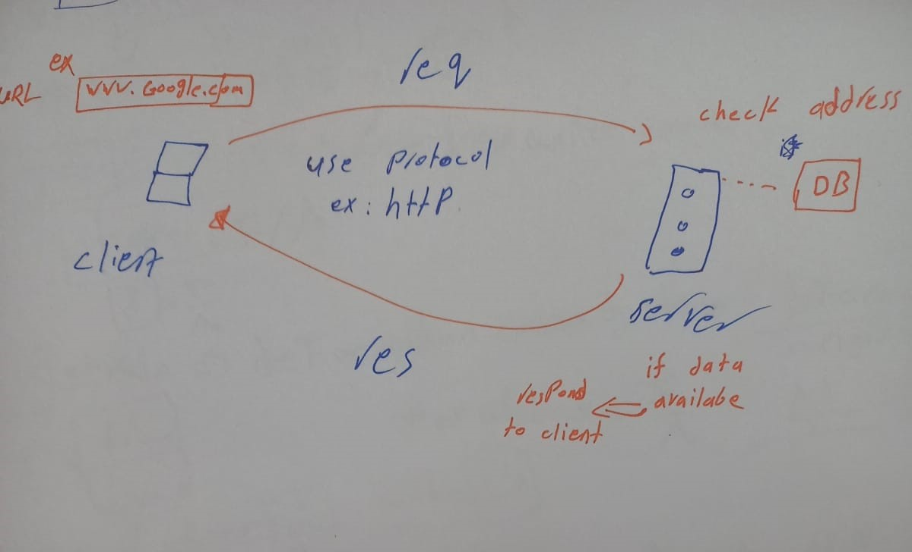

# Movies-Library 1.0.0

## **Author Name**: Abdelrahman Saleh

## WRRC (Web request, Respons cycle)

## Overview
This project handles a simple request and response in the server side using NodeJS and Express framework.
## Getting Started
- Initialize your project by running this command "npm init -y"
- Create basic file structure (server.js, .gitignore).
- Install the required packages for this project: "npm install express"
- Implement your code and write the endpoints handler functions.
- Create a new reauest using the thunder client extinsion to recieve the dseiered response.
- Run the server by typing "node server.js".

## Project Features
- Status code error handeling, it covers the basic cases with 404 and 500 codes and handels them accordingly.
- The website has two main endpoints with coresponding data for each endpoint.

